<div align="center">


<br/>

[](https://khoalt.dev)
[]()
[](mailto:khoalt25791@gmail.com)
[](https://linkedin.com/in/khoa-le-senior-engineer)

</div>

*I translate complex specifications into high-performance, bulletproof software.*

---

## 💻 `khoa --status`

```yaml
role: Senior Full Stack Engineer
location: London, United Kingdom (UTC+1)
experience: 12+ Years
specialties: Full-Stack Architecture, Video/Media Engineering, DevOps, AI Workflows
```

---

## 📁 `khoa --view README.md`

With **12+ years of experience** building full-stack products across front-end, back-end, and cloud infrastructure, I focus on practical systems that require high performance, reliability, and high development velocity. 

I work comfortably in AI-assisted, spec-driven environments and regularly leverage advanced tools to accelerate implementation and improve code quality.

---

## 📁 `khoa --view projects.db`

| | Project | What it is |
|---|---------|-----------|
| 🌐 | **[khoalt.dev](https://github.com/KhoaTheBest/khoa-portfolio)** | My personal portfolio website. Pure-monospace, solid-black terminal aesthetic built with Astro, Tailwind CSS, and HTML5. |
| 🤖 | **[opcode-clone](https://github.com/KhoaTheBest/opcode-clone)** | A powerful desktop GUI and toolset wrapper for Claude Code CLI, offering background tasks, multi-agent management, and session visualization. |
| 🎬 | **[video-stitching-frontend](https://github.com/KhoaTheBest/video-stitching-frontend)** | React + MediaBunny frontend application demonstrating real-time in-browser video manipulation, clipping, and clip stitching. |
| 🛠️ | **[vps-bootstrap](https://github.com/KhoaTheBest/vps-bootstrap)** | Automated bash bootstrap scripts for hardening Linux VPS servers and setting up developer/Docker environments. |

---

## 📁 `khoa --view skills.json`

```json
{
  "frontend": [
    "React", "Next.js", "TypeScript", "TailwindCSS", "Astro", "SCSS"
  ],
  "backend": [
    "Node.js", "Python", "Ruby on Rails", "PostgreSQL", "MongoDB", "Socket.io"
  ],
  "cloud_infra": [
    "AWS", "GCP", "Kubernetes", "Docker", "Nginx", "PM2", "CI/CD"
  ],
  "media_engineering": [
    "Remotion", "FFmpeg", "Serverless Media Pipelines"
  ],
  "ai_workflows": [
    "Claude Code", "Cursor", "Codex", "Spec-driven Development", "AG-UI"
  ]
}
```

---

## 📁 `khoa --view experience.sh`

```bash
#!/bin/bash

# Lead Full Stack Engineer @ Pencil AI (2019 - Present)
# - Led development of AI content creation platform (Next.js, React, Node.js, Python, AWS, GCP).
# - Built real-time in-browser video manipulation, clip stitching, and thumbnail generation using Remotion.
# - Refactored asset processing pipeline to eliminate server-side dependencies, optimizing cloud costs.
# - Built dynamic Agent-Generated UI (AG-UI) components using CopilotKit.

# Full Stack Engineer @ Metro Residences (2018 - 2019)
# - Managed React & Node.js real estate platform on AWS/GCP (Docker, Kubernetes, PostgreSQL, MongoDB).

# Senior Software Engineer @ Freelancer.com (2017 - 2018)
# - Led React Native & Node.js mobile/web platform. Optimized payment gateway and geolocations.

# Software Engineer @ Robert Bosch (2013 - 2016)
# - Built embedded systems, firmware, and IoT diagnostics solutions using C/C++.
```

---

## 📁 `khoa --view workflow.md`

```markdown
1. Spec first, then ship
   Define specs clearly, split into atomic milestones, and verify goals before shipping.
2. AI-assisted, not AI-driven
   Use AI tools (Claude Code, Codex) to 10x velocity while retaining deep review and judgment.
3. Practical & delivery-focused
   Optimize for business outcomes, high execution speed, and bulletproof system reliability.
4. Seamless remote collaboration
   Async-first communication, written-first documentation, and London-to-US timezone overlap.
```

---

## 📊 `khoa --stats`

<div align="center">




<br/><br/>

[](https://git.io/streak-stats)

</div>

---

## 🛠️ `khoa --view stack`

<div align="center">


</div>

---

<div align="center">
<sub>building high-performance products · spec-first · AI-accelerated · senior full-stack engineer 🤝</sub>
</div>
